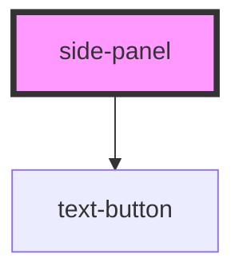

# side-panel

<!-- Auto Generated Below -->

## Properties

| Property   | Attribute  | Description | Type      | Default     |
| ---------- | ---------- | ----------- | --------- | ----------- |
| `closable` | `closable` |             | `boolean` | `true`      |
| `isOpen`   | `open`     |             | `boolean` | `false`     |
| `label`    | `label`    |             | `string`  | `undefined` |

## Dependencies

### Depends on

- [text-button](../../controls/text-button)

### Graph

----------------------------------------------

*Built with [StencilJS](https://stenciljs.com/)*
