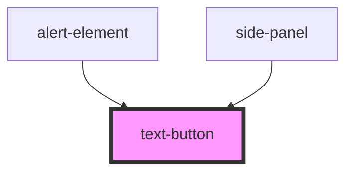

# text-button

<!-- Auto Generated Below -->

## Properties

| Property | Attribute | Description | Type                                        | Default     |
| -------- | --------- | ----------- | ------------------------------------------- | ----------- |
| `theme`  | `theme`   |             | `"default" \| "green" \| "red" \| "yellow"` | `'default'` |

## Dependencies

### Used by

 - [alert-element](../../elements/alert-element)
 - [side-panel](../../containers/side-panel)

### Graph

----------------------------------------------

*Built with [StencilJS](https://stenciljs.com/)*
