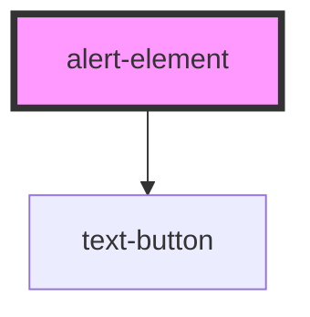

# alert-element

<!-- Auto Generated Below -->

## Properties

| Property      | Attribute     | Description | Type                                        | Default  |
| ------------- | ------------- | ----------- | ------------------------------------------- | -------- |
| `dismissable` | `dismissable` |             | `boolean`                                   | `true`   |
| `persistKey`  | `persist-key` |             | `string`                                    | `null`   |
| `theme`       | `theme`       |             | `"danger" \| "good" \| "info" \| "warning"` | `'info'` |

## Dependencies

### Depends on

- [text-button](../../controls/text-button)

### Graph

----------------------------------------------

*Built with [StencilJS](https://stenciljs.com/)*
