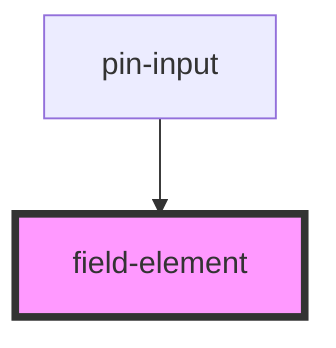

# field-element

<!-- Auto Generated Below -->

## Properties

| Property   | Attribute   | Description | Type      | Default     |
| ---------- | ----------- | ----------- | --------- | ----------- |
| `label`    | `label`     |             | `string`  | `undefined` |
| `useLabel` | `use-label` |             | `boolean` | `true`      |

## Dependencies

### Used by

 - [pin-input](../../inputs/pin-input)

### Graph

----------------------------------------------

*Built with [StencilJS](https://stenciljs.com/)*
