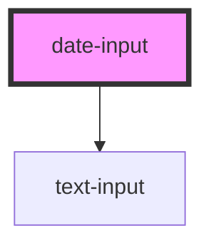

# date-input

<!-- Auto Generated Below -->

## Properties

| Property       | Attribute       | Description | Type      | Default     |
| -------------- | --------------- | ----------- | --------- | ----------- |
| `initialValue` | `initial-value` |             | `string`  | `undefined` |
| `name`         | `name`          |             | `string`  | `'date'`    |
| `required`     | `required`      |             | `boolean` | `false`     |
| `value`        | `value`         |             | `string`  | `undefined` |

## Events

| Event     | Description | Type                  |
| --------- | ----------- | --------------------- |
| `changed` |             | `CustomEvent<string>` |

## Dependencies

### Depends on

- [text-input](../text-input)

### Graph

----------------------------------------------

*Built with [StencilJS](https://stenciljs.com/)*
