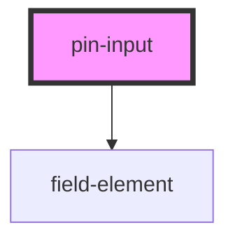

# pin-input

<!-- Auto Generated Below -->

## Properties

| Property | Attribute | Description | Type     | Default     |
| -------- | --------- | ----------- | -------- | ----------- |
| `value`  | `value`   |             | `string` | `undefined` |

## Events

| Event     | Description | Type                  |
| --------- | ----------- | --------------------- |
| `changed` |             | `CustomEvent<string>` |

## Dependencies

### Depends on

- [field-element](../../elements/field-element)

### Graph

----------------------------------------------

*Built with [StencilJS](https://stenciljs.com/)*
