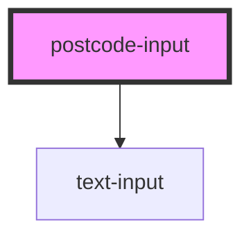

# postcode-input

<!-- Auto Generated Below -->

## Properties

| Property       | Attribute       | Description | Type     | Default      |
| -------------- | --------------- | ----------- | -------- | ------------ |
| `initialValue` | `initial-value` |             | `string` | `undefined`  |
| `name`         | `name`          |             | `string` | `'postcode'` |
| `value`        | `value`         |             | `string` | `undefined`  |

## Dependencies

### Depends on

- [text-input](../text-input)

### Graph

----------------------------------------------

*Built with [StencilJS](https://stenciljs.com/)*
