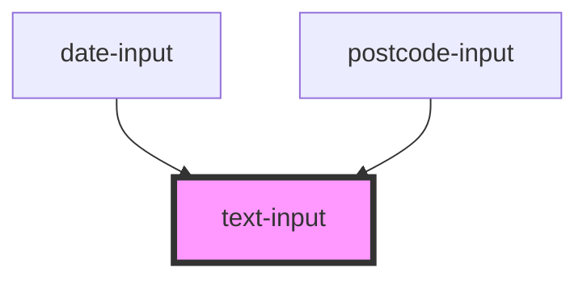

# text-input

<!-- Auto Generated Below -->

## Properties

| Property       | Attribute       | Description | Type                               | Default     |
| -------------- | --------------- | ----------- | ---------------------------------- | ----------- |
| `autoComplete` | `auto-complete` |             | `string`                           | `'off'`     |
| `hint`         | `hint`          |             | `string`                           | `undefined` |
| `name`         | `name`          |             | `string`                           | `undefined` |
| `required`     | `required`      |             | `boolean`                          | `false`     |
| `type`         | `type`          |             | `"number" \| "password" \| "text"` | `'text'`    |
| `value`        | `value`         |             | `string`                           | `undefined` |
| `width`        | `width`         |             | `number`                           | `32`        |

## Events

| Event     | Description | Type                  |
| --------- | ----------- | --------------------- |
| `changed` |             | `CustomEvent<string>` |

## Dependencies

### Used by

 - [date-input](../date-input)
 - [postcode-input](../postcode-input)

### Graph

----------------------------------------------

*Built with [StencilJS](https://stenciljs.com/)*
